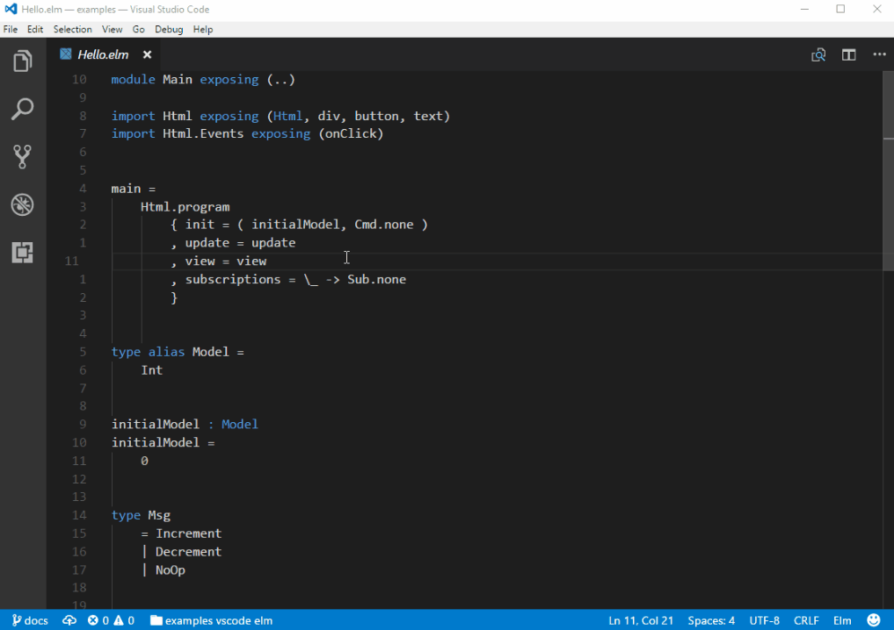
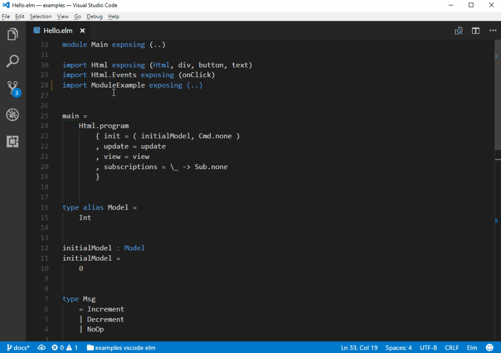
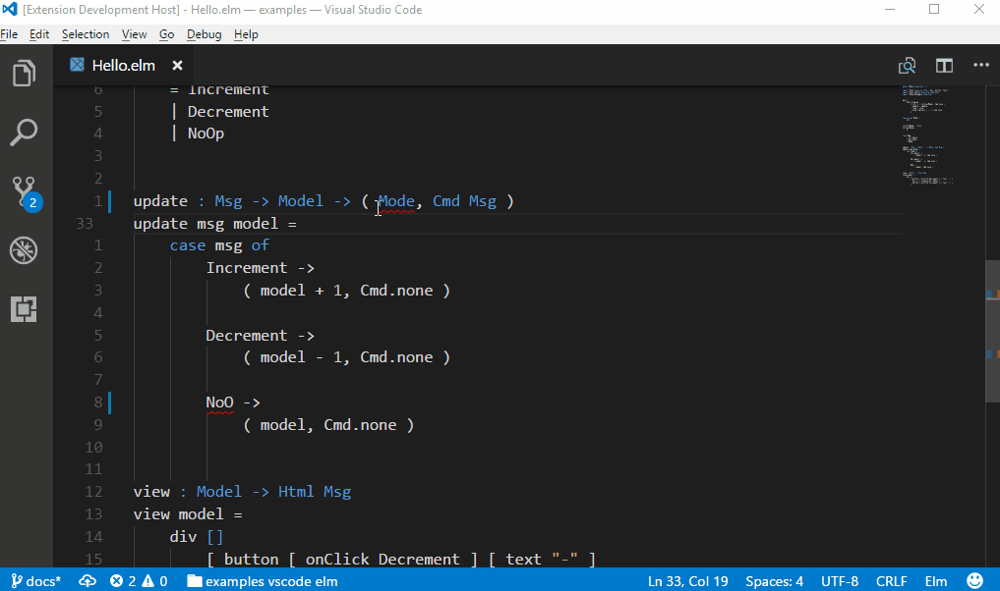
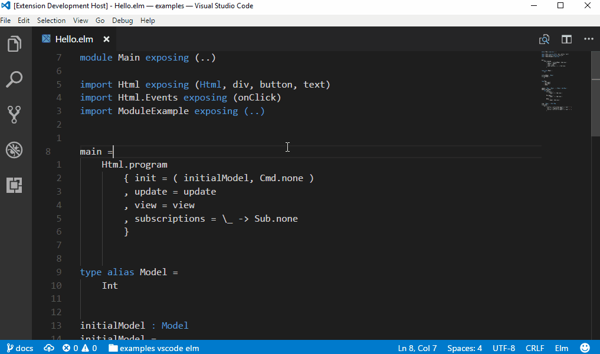
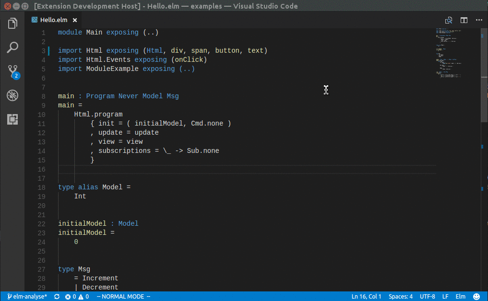

### This project is deprecated. For modern Elm support in VSCode use https://marketplace.visualstudio.com/items?itemName=Elmtooling.elm-ls-vscode (GitHub: https://github.com/elm-tooling/elm-language-client-vscode)

---

# Elm support for Visual Studio Code


## Feature overview

* Syntax highlighting
* Autocomplete (for external packages and experimental for local project)
* Error highlighting
* Hover info
* Document Symbol provider (Go to definition, list and search symbols)
* Code Actions (Lightbulb on errors and warnings with fixes)
* Integration with Elm Package (Browse and install packages)
* REPL integration
* Integration with Elm Reactor
* Integration with Elm Make
* Custom Elm Snippets
* Code formatting with Elm-format
* Elm-analyse integration (experimental) with warnings and code actions

## Elm Installation

### Global Installation

Follow [this guide](https://guide.elm-lang.org/install.html).

### Project (Local) Installation

Run `npm install --save-dev elm`

Then, in `.vscode/settings.json`, add the following:

```
"elm.compiler": "./node_modules/.bin/elm",
"elm.makeCommand": "./node_modules/.bin/elm-make"
```

For Windows
```
"elm.compiler": ".\\node_modules\\.bin\\elm",
"elm.makeCommand": ".\\node_modules\\.bin\\elm-make"
```

## Feature details

### Syntax highlighting

Syntax highlighting is essential. The full language is supported. Fenced code blocks in markdown files are highlighted too. Can we improve the highlighting further? Please create an [issue](https://github.com/sbrink/vscode-elm/issues)!

### Error highlighting

We support error highlighting **on save**. If you check *Auto save* under File, you should get feedback immediately.


This is marked **experimental** because we still have to improve the project detection.

### Hover info - Function information


You can hover over a function and get the signature and comment.

### Document and Workspace symbols

Use context menu "Go to definition" or F12. Alt+F12 to Peek



Ctrl+Shift+O for document symbols and Ctrl+T for workspace symbols



### Code Actions (Lightbulb on errors and warnings with fixes)

Tip - use Ctrl+. to invoke code action when the lightbulb is visible



### Integration with Elm Package (Browse and install packages)

Ctrl+Shift+P - Elm browse packages



Ctrl+Shift+P - Elm install package


### Local Project Intellisense (experimental)

vscode-elm will scan your projects to build intellisense results.
**Assumption** your files match the layout of elm-format

Example behaviors are:

* suggesting function names available in the current file or imported from your own modules
* suggesting module names you have imported in the current file
* suggesting union type or type alias names in function signatures
* suggesting possible values of a union type
* suggesting properties of a record. This requires that record is a parameter in the current function and the function has a type signature.

**important note regarding performance**

With `elm.userProjectImportStrategy` set to `"dynamicLookup"` (default), every hover or autocomplete action will trigger a scan of the first few lines of every file in your src directory (not the elm-stuff directory). This is done to establish an accurate list of module names but could be slow for exceptionally large projects.

In testing with the Elm SPA example project no slowdown was noticed, but if your project slows down try one of these alternate settings:

* `"semiDynamicLookup"` - the above directory scan still takes place but only once, then the results are stored in memory.  Subsequent hover or autocomplete results will be instantaneous but the list of available modules will only update if the window is reloaded.
* `"dotIsFolder"` - this assumes that any module name with a `.` in it is contained in a folder. For example Page.Home would attempt to look for Home.elm inside of the \Page\ folder.
* `"dotIsFilenameCharacter"` - this setting does not attempt to create a directory structure for Page.Home and instead looks for a file named \Page.Home.elm
* `"ignore"` - do not attempt to look in imported modules for intellisense


### REPL integration


Not sure about the output of a function? Test it from inside the editor.

Open the actions menu and use one of the following commands:

* Elm: REPL - Start
* Elm: REPL - Stop
* Elm: REPL - Send Line
* Elm: REPL - Send Selection
* Elm: REPL - Send File

### Reactor integration


Reactor is the webserver which comes with Elm.

* Reactor allows recompiling on-the-fly.
* Reactor contains the [Time-traveling debugger](http://debug.elm-lang.org/).

We support starting / stopping from within the editor.

### Integration with Elm Make

* Elm: Make
* Elm: Make --warn
* Make user setting to choose a fixed file to make

### Snippets

We support snippets for the basic language features. To use them, press `Ctrl+Space` and start typing.
Or start with some characters and use `Ctrl+Space` for autocompletion.

Want to know more? Look at the [snippet definitions](snippets/elm.json)

### Formatting with Elm-format

[elm-format](https://github.com/avh4/elm-format) is supported via the editor's `Format Code` command. To format your code using `elm-format`, press `Shift+Alt+F` on Windows, `Shift+Option+F` on Mac, or `Ctrl+Shift+I` on Linux.

You can also configure `elm-format` to run on save by enabling `editor.formatOnSave` in your settings.

```
// settings.json
{
    "[elm]": {
        "editor.formatOnSave": true
    }
}
```

On Windows you may [need](https://github.com/Krzysztof-Cieslak/vscode-elm/issues/191#issuecomment-371465313) to add `editor.formatOnSaveTimeout`:

``` settings.json
"[elm]": {
    "editor.formatOnSave": true,
    "editor.formatOnSaveTimeout": 1500
},
```

### Elm-format - local installation
If you have elm-format installed locally add this line to '.vscode/settings.json'

```
"elm.formatCommand": "./node_modules/.bin/elm-format"
```

For Windows
```
"elm.formatCommand": ".\\node_modules\\.bin\\elm-format"
```


### Elm-analyse integration
[Elm-analyse](https://github.com/stil4m/elm-analyse) is a tool that allows you to analyse your Elm code, identify deficiencies and apply best practices.
The integration enables vscode to show any problems identified by elm-analyse as linting warnings in your code.



With a button to stop the elm-analyse process


To install elm-analyse
```
// bash/console
{
    npm install elm-analyse -g
}
```

Commands:

* To enable, run the command: Elm: `Start elm-analyse`
* To disable, run the comand: Elm: `Stop elm-analyse`
* When available - Code actions will show lightbulb to fix issue

When running, any issues will show up in the problems window (`Ctrl+Shift+M`), `F8` to cycle. Issues will also show up as green linting warnings in your code.

NOTE: *This is an early version*

* Elm-analyse and this integration is still under development. API will change.
* Running elm-analyse as a process inside vscode can cause performance issues. You can start elm-analyse as a separate process. When using the same port as specified in settings, the extension will detect the external process and use that instead of starting inside vscode.
* Mostly working, but if the elm-analyse process was not stopped: Linux: ps aux | grep elm-analyse $kill -9 {process id from ps} / On Windows - locate node elm-analyse process

Elm-analyse settings:

* `elm.analyseCommand` - Command to run when executing elm-analyse
* `elm.analysePort` - Port used by elm-analyse process
* `elm.analyseEnabled` - Enable or disable elm-analyse process on startup.

### Clean Build Artifacts

You can delete your `elm-stuff/build-artifacts` directly from vscode by using `Elm: Clean build artifacts` command.

## Acknowledgements

* Grammar file is taken and converted from [atom-elm](https://github.com/edubkendo/atom-elm).
* Initial snippets from [Elm.tmLanguage](https://github.com/deadfoxygrandpa/Elm.tmLanguage)

## How to contribute

*Imposter syndrome disclaimer*: I want your help. No really, I do.

There might be a little voice inside that tells you you're not ready; that you need to do one more tutorial, or learn another framework, or write a few more blog posts before you can help me with this project.

I assure you, that's not the case.

This project has some clear Contribution Guidelines and expectations that you can [read here](https://github.com/Krzysztof-Cieslak/vscode-elm/blob/master/CONTRIBUTING.md).

The contribution guidelines outline the process that you'll need to follow to get a patch merged. By making expectations and process explicit, I hope it will make it easier for you to contribute.

And you don't just have to write code. You can help out by writing documentation, tests, or even by giving feedback about this work. (And yes, that includes giving feedback about the contribution guidelines.)

Thank you for contributing!

## Contributing and copyright

The project is hosted on [GitHub](https://github.com/Krzysztof-Cieslak/vscode-elm/) where you can [report issues](https://github.com/Krzysztof-Cieslak/vscode-elm/issues), fork
the project and submit pull requests. Please read the [CONTRIBUTING](https://github.com/Krzysztof-Cieslak/vscode-elm/blob/master/CONTRIBUTING.md) document for more information.

The library is available under [MIT license](https://github.com/Krzysztof-Cieslak/vscode-elm/blob/master/LICENSE.md), which allows modification and redistribution for both commercial and non-commercial purposes.

Please note that this project is released with a [Contributor Code of Conduct](CODE_OF_CONDUCT.md). By participating in this project you agree to abide by its terms.

## Maintainer(s)

* Krzysztof Cieslak [@Krzysztof-Cieslak](https://github.com/Krzysztof-Cieslak)
* Dave Thomas [@7sharp9](https://github.com/7sharp9)
* Håkon Rossebø [@hakonrossebo](https://github.com/hakonrossebo)

## Past Maintainer(s)

* Sascha Brink [@sbrink](https://github.com/sbrink)
* Robert Jeppesen [@rojepp](https://github.com/rojepp)
